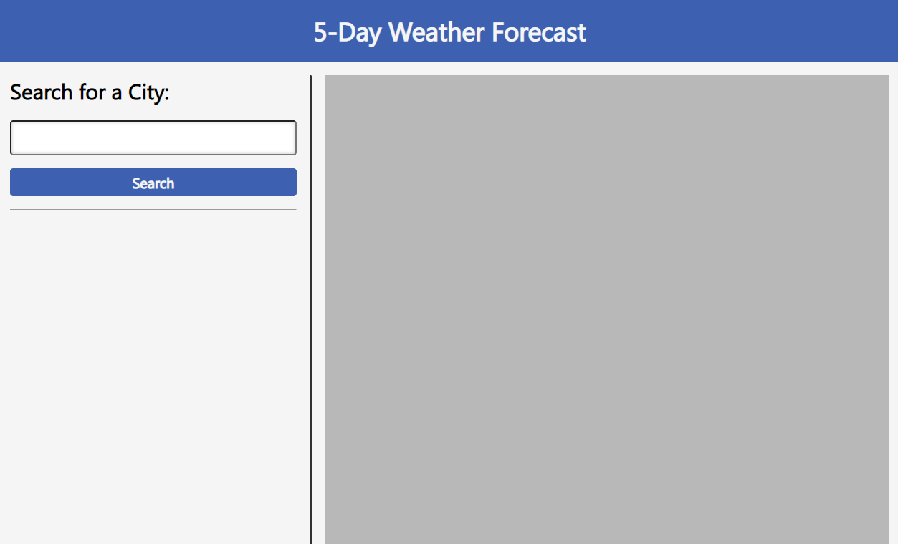
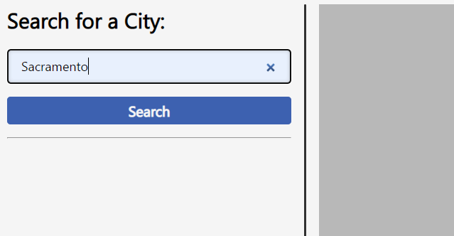
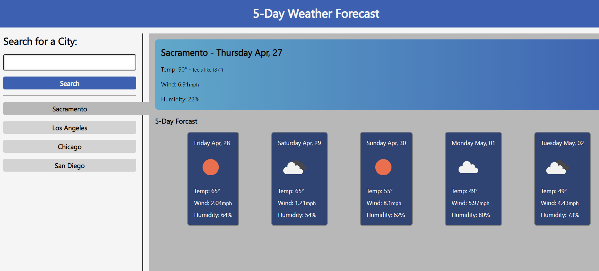

# 5 Day Weather Forecast

<a  id='site-launch'  href='https://nateayye.github.io/5-day-forecast/'>&#129193; Lauch Live Site Here &#129192;</a>

## Description

A Weather app for searching cities by name and it will grab the local weather for that city through an API ([5 Day Weather Forecast](https://openweathermap.org/forecast5))

Then dynamically save the data for the city in localStorage. so that the searched cities can be loaded back up when a user reloads or comes back.

## Installation

Fork or Clone this repository on your local machine and open it up with your browser however you decide.

## Usage

When You first Enter The Site You will be Greeted with an empty page with one search field and one search button for the input.

You can now either navigate to the input field with tab or mouse and enter in your desired City.

Same as before by navigating to the search button and you can search your city for the weather to be displayed

It may take a second. But not to long if it has their was probably an error within the api call you can just try again.

but on a successfull search you should get a new button bellow the search bar and the main panel

You can search for as many Cities as you'd like but it will prevent you from searching the same city twice and empty input's.

Also after The City is searched it is saved in localStorage for the user so that it will be persistent on page load and re-visits.

## License

Refer to the LICENSE file within the root directory
